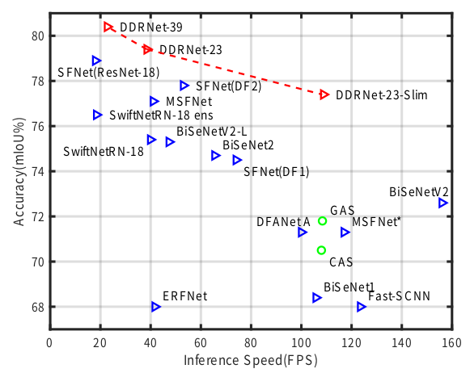
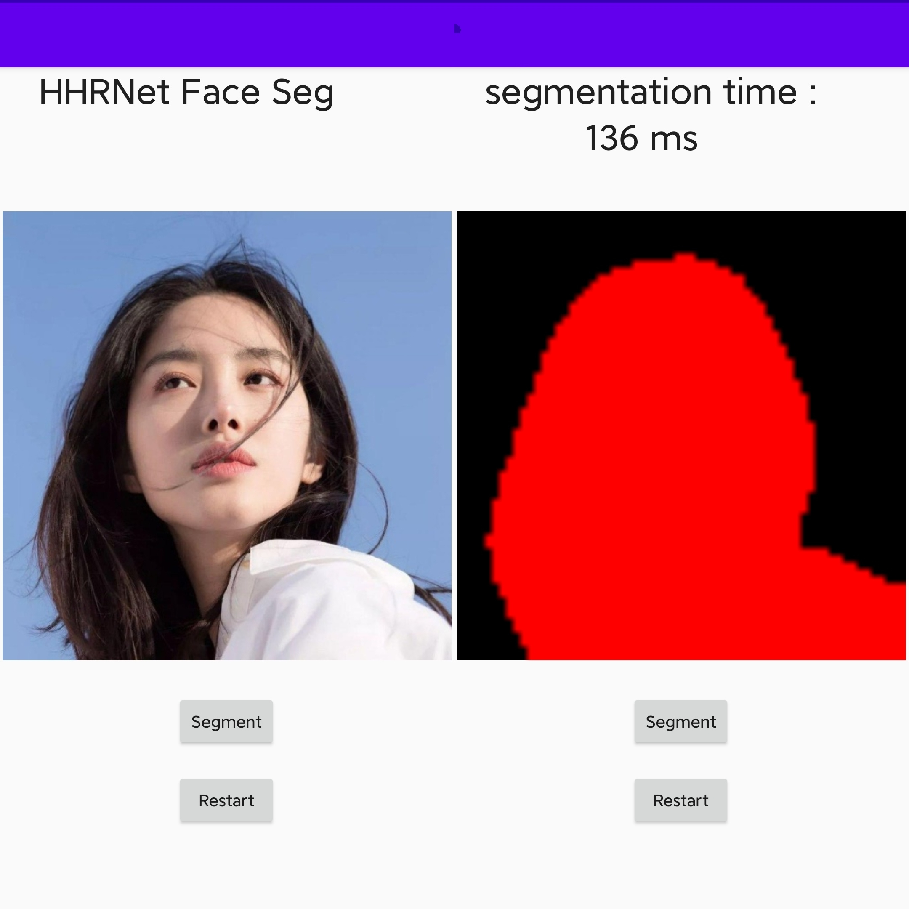

# Deep Dual-resolution Networks for Real-time and Accurate Semantic Segmentation of Road Scenes

## Introduction
This is the unofficial code of [Deep Dual-resolution Networks for Real-time and Accurate Semantic Segmentation of Road Scenes](https://arxiv.org/pdf/2101.06085.pdf). the origin official is [the official repository](https://github.com/ydhongHIT/DDRNet), and I borrowed most of the code from [DDRNet.Pytorch](https://github.com/chenjun2hao/DDRNet.pytorch)thanks for their work.

<figure>
  <text-align: center;>
  <center>
  
  </center>
</figcaption>
</figure>

## Main Change 

1. Input 512*512;
2. Change DAPPM module ;
3. Data augmentation: random_brightness,random_RotateAndCrop, random_hue, random_saturation, random_contrast ...
4. Train on face segmentation dataset[Semantic_Human_Matting](https://github.com/aisegmentcn/matting_human_datasets)

## Quick start

### 1. Data preparation

You need to download the [Semantic_Human_Matting](https://github.com/aisegmentcn/matting_human_datasets)datasets. and rename the folder `face`, then put the data under `data` folder. 
```
└── data
  ├── face
       |————train_images
       |————train_labels
       |————val_images
       |————val_labels
  └── list
```

### 2. Pretrained model

download the pretrained model on imagenet or the segmentation model from the [official](https://github.com/ydhongHIT/DDRNet)，and put the files in `${PROJECT}/pretrained_models` folder


### 3. TRAIN

download [the imagenet pretrained model](https://github.com/ydhongHIT/DDRNet), and then train the model with 2 nvidia-3080

```python
python tools/train_single.py --cfg experiments/face/ddrnet23_slim.yaml
```

## Results

<figure>
  <text-align: center;>
  <center>
  
  </center>
</figcaption>
</figure>

## Train Custom Data

The only change is to write your own dataset, you can reference to ‘./lib/datasets’

## Mobile Seg

follow [TorchMobile](https://pytorch.org/mobile/home/),test with S855+ and take about 150 ms per image.

<figure>
  <text-align: center;>
  <center>
  
  </center>
</figcaption>
</figure>

## TensorRT 

https://github.com/midasklr/DDRNet.TensorRT

Test on RTX2070

| model          | input           | FPS  |
| -------------- | --------------- | ---- |
| Pytorch-aug    | （3,1024,1024） | 107  |
| Pytorch-no-aug | （3,1024,1024） | 108  |
| TensorRT-FP32  | （3,1024,1024） | 117  |
| TensorRT-FP16  | （3,1024,1024） | 215  |
| TensorRT-FP16  | （3,512,512）   | 334  |

Pytorch-aug means augment=True.

## Reference

[1] [DDRNet](https://github.com/chenjun2hao/DDRNet.pytorch) 

[2] [the official repository](https://github.com/ydhongHIT/DDRNet)

